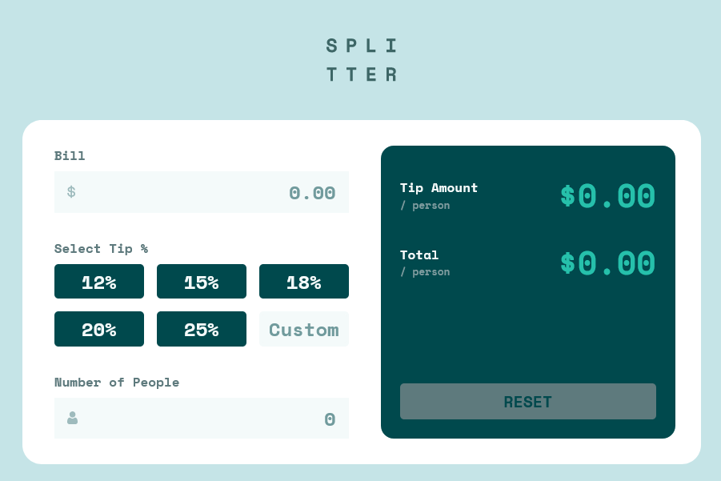
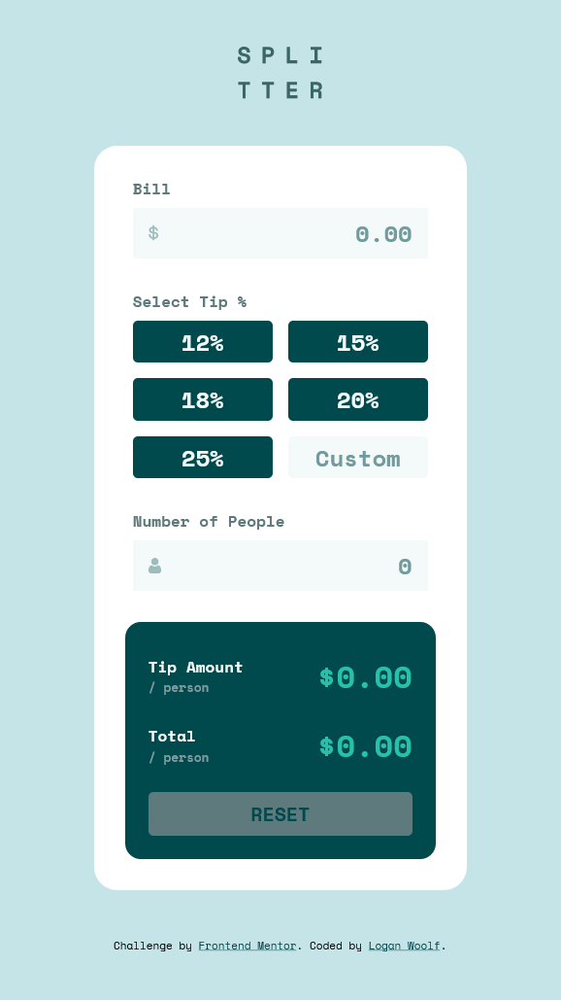

# Frontend Mentor - Tip calculator app solution

This is a solution to the [Tip calculator app challenge on Frontend Mentor](https://www.frontendmentor.io/challenges/tip-calculator-app-ugJNGbJUX). Frontend Mentor challenges help you improve your coding skills by building realistic projects.

## Table of contents

- [Overview](#overview)
  - [The challenge](#the-challenge)
  - [Screenshot](#screenshot)
  - [Links](#links)
- [My process](#my-process)
  - [Built with](#built-with)
  - [What I learned](#what-i-learned)
  - [Continued development](#continued-development)
- [Author](#author)

## Overview

### The challenge

Users should be able to:

- View the optimal layout for the app depending on their device's screen size
- See hover states for all interactive elements on the page
- Calculate the correct tip and total cost of the bill per person

### Screenshot




### Links

- Solution URL: [https://www.frontendmentor.io/challenges/tip-calculator-app-ugJNGbJUX/hub/js-tip-calculator-2MQF7Xi6T](https://www.frontendmentor.io/challenges/tip-calculator-app-ugJNGbJUX/hub/js-tip-calculator-2MQF7Xi6T)
- Live Site URL: [https://loganwoolf.github.io/tip-calc/](https://loganwoolf.github.io/tip-calc/)

## My process

### Built with

- Semantic HTML5 markup
- CSS Flexbox
- CSS Grid
- Vanilla JS
- Mobile-first workflow

### What I learned

- The actual tip rate radio buttons are hidden, and the label acts as the indicator of selection.

```css
  /*Hides actual radio button*/
.option-radio > input { 
   visibility: hidden;
   position: absolute;
}
```
- The rates array values are mapped to labels for each radio button
```js
// define tip rates available on first 5 buttons, 6th will override custom field
const rates = [0.12, 0.15, 0.18, 0.20, 0.25];

// select input elements
const radioButtons = document.querySelectorAll('input[type=radio]');

//map and format rates to textContent of each button
rates.map((rate, i) => {
	radioButtons[i].labels[0].textContent = `${rate*100}%`
});
```

### Continued development

- Some state management could fix the problem with adding characters to the middle of input strings and causing bad inputs. 
  1. Copy previous input to a variable
  1. Check validity of current input
  1. Revert if invalid

- More functions could be added to reduce complexity of `calculate()` function.

## Author

- Website - [https://loganwoolf.github.io](https://loganwoolf.github.io)
- Frontend Mentor - [@loganwoolf](https://www.frontendmentor.io/profile/loganwoolf)
- Twitter - [@logan__woolf](https://www.twitter.com/logan__woolf)
